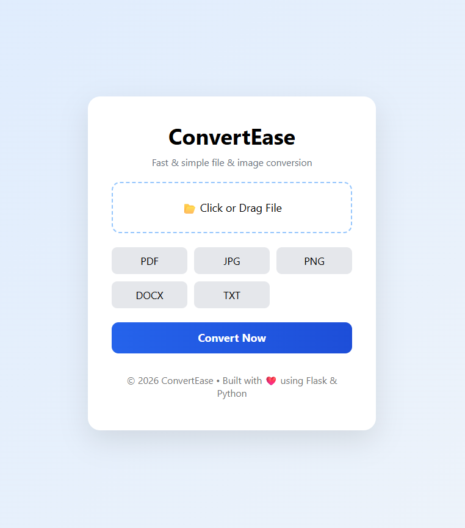
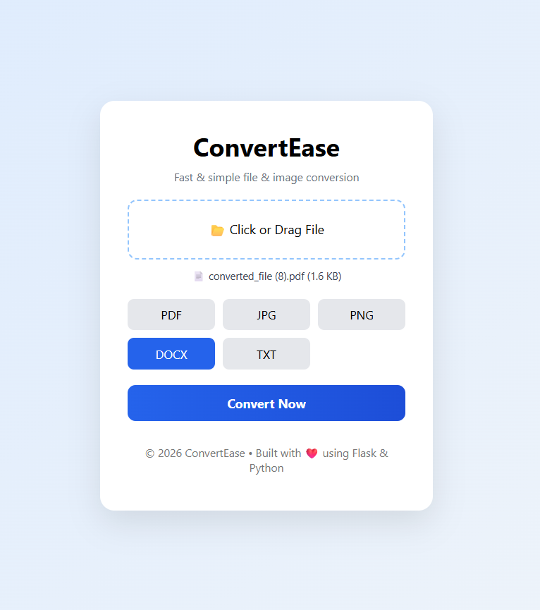
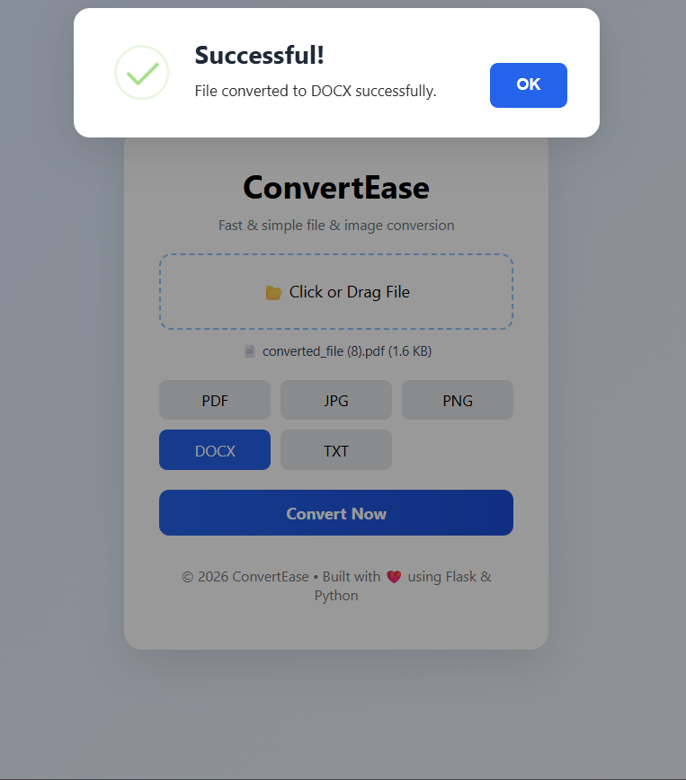

# 📂 ConvertEase – File Converter

ConvertEase is a web-based file conversion application built using **Flask** and **Python**. It provides a simple and user-friendly interface that allows users to upload files, select a supported output format, and download the converted file instantly.

The project was developed as a mini project to demonstrate file handling, format conversion, image processing, OCR, and backend web development using Python.

---

##🌐 Live Demo

**ConvertEase — Live Demo** - https://convertease-7prq.onrender.com

---

# ✨ Features

* 📁 Upload files using **click-to-upload** or **drag & drop**.
* 🔄 Convert files between multiple supported formats.
* ⚡ Fast conversion using Python libraries.
* 🎨 Clean, responsive, and user-friendly interface.
* 🚫 Prevents unsupported conversions.
* ⚠️ Displays meaningful error messages for invalid operations.
* 📏 Upload size limit (**25 MB**) for improved stability.
* 🔒 Handles unsupported file types safely.
* 🔍 OCR support for extracting text from images.

---

# 🔄 Supported Conversions

## 🖼️ Image Files (PNG, JPG, JPEG)

| From     | To   |
| -------- | ---- |
| PNG      | JPG  |
| PNG      | PDF  |
| PNG      | DOCX |
| PNG      | TXT  |
| JPG/JPEG | PNG  |
| JPG/JPEG | PDF  |
| JPG/JPEG | DOCX |
| JPG/JPEG | TXT  |

---

## 📄 PDF Files

| From | To   |
| ---- | ---- |
| PDF  | TXT  |
| PDF  | DOCX |
| PDF  | PNG  |
| PDF  | JPG  |

---

## 📝 Text Files

| From | To   |
| ---- | ---- |
| TXT  | PDF  |
| TXT  | DOCX |
| TXT  | PNG  |
| TXT  | JPG  |

---

## 📃 Word Documents

| From | To  |
| ---- | --- |
| DOCX | TXT |

---

# 🛠️ Technologies Used

### Backend

* Python
* Flask

### Frontend

* HTML5
* CSS3
* JavaScript

### Python Libraries

* Pillow (Image Processing)
* PyMuPDF (PDF Processing)
* python-docx
* FPDF
* pytesseract (OCR)
* io
* os

---

# 📁 Project Structure

```text
ConvertEase/
│
|__screenshorts
├── static/
│   ├── css/
│   │   └── dashboard.css
│   │
│   └── js/
│       └── dashboard.js
│
├── templates/
│   └── dashboard.html
│
├── conversion_modules.py
├── app.py
├── requirements.txt
└── README.md
```

---

# 🚀 Installation

### 1. Clone the repository

```bash
git clone https://github.com/your-username/ConvertEase.git
```

### 2. Navigate to the project folder

```bash
cd ConvertEase
```

### 3. Create a virtual environment

```bash
python -m venv venv
```

### 4. Activate the virtual environment

**Windows**

```bash
venv\Scripts\activate
```

### 5. Install dependencies

```bash
pip install -r requirements.txt
```

### 6. Run the application

```bash
python app.py
```

Open your browser and visit:

```
http://127.0.0.1:5000
```

---

# 🔍 OCR Requirement

This project uses **pytesseract** for Optical Character Recognition (OCR) to extract text from images.

The OCR functionality is required for:

* **Image → TXT**
* **Image → DOCX**

> **Important:** Installing the Python package alone is **not sufficient**. You must also install the **Tesseract OCR Engine** separately on your system.

### Install the Python package

```bash
pip install pytesseract
```

### Install the Tesseract OCR Engine

Download and install the **Tesseract OCR Engine** for your operating system.

After installation, specify the Tesseract executable path in your Python code (if it is not added to your system's PATH):

```python
import pytesseract

pytesseract.pytesseract.tesseract_cmd = r"C:\Program Files\Tesseract-OCR\tesseract.exe"
```

> **Note:** Without installing the Tesseract OCR Engine, **Image → TXT** and **Image → DOCX** conversions will not work.

---

# ⚠️ Current Limitations

This project intentionally supports only a selected set of conversions.

The following conversions are **not supported**:

* DOCX → PDF
* DOCX → PNG
* DOCX → JPG
* DOCX → JPEG

These conversions require external software or operating-system-specific dependencies, which were intentionally avoided to keep the project lightweight and easy to run.

Additional limitations include:

* Maximum upload size: **25 MB**
* One file can be converted at a time.
* Complex PDF layouts may not preserve formatting perfectly when converted to TXT or DOCX.
* PNG → JPG conversion may result in slight quality loss because JPEG uses lossy compression.
* JPG → PNG conversion does **not** improve image quality; it only changes the file format.
* OCR accuracy depends on image quality, font style, resolution, and text orientation.
* Drag-and-drop currently supports a single file at a time.

---

# 💡 Future Improvements

The following features can be added in future versions:

* Support batch (multiple file) conversion.
* Add more file formats such as Excel, PowerPoint, ZIP, and GIF.
* Progress bar for large file conversions.
* Preview uploaded files before conversion.
* User-selectable image quality during JPG conversion.
* Password-protected PDF support.
* Cloud storage integration.
* Conversion history.
* Dark mode.
* API support for developers.
* Automatic deletion of temporary files after download for enhanced security.

---

# 📸 Screenshots

Add screenshots of your application here.

Suggested screenshots:

* Home Page

* File Selected

* Successful Conversion


---
